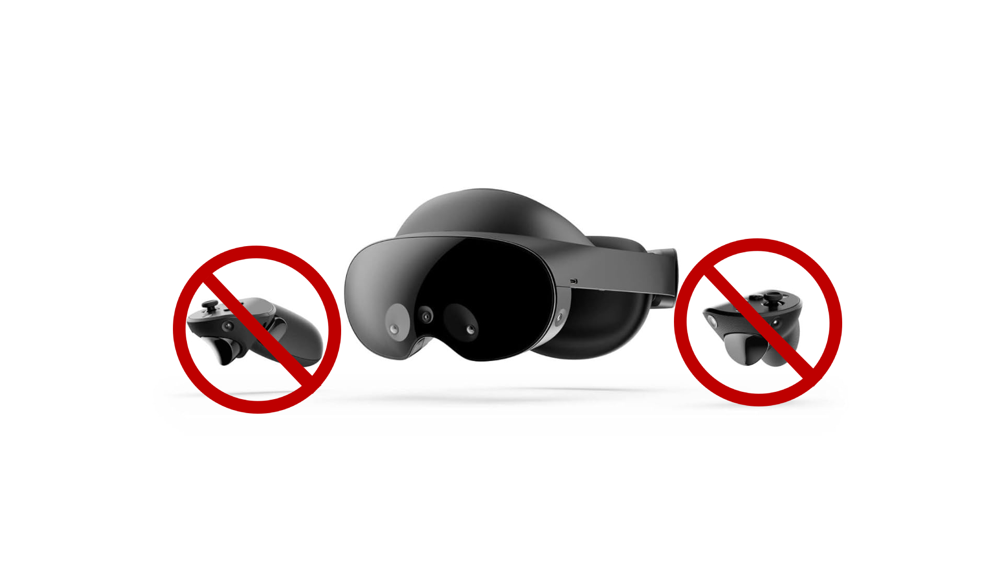
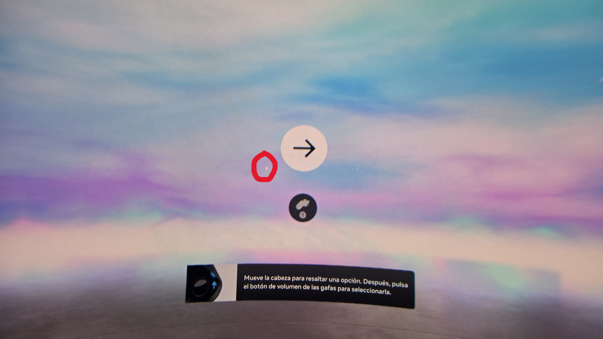
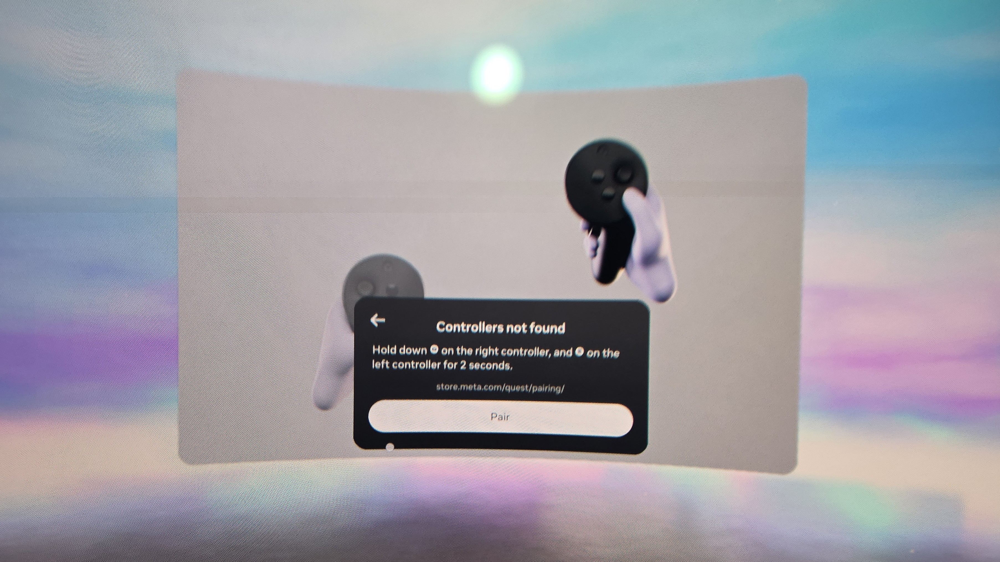
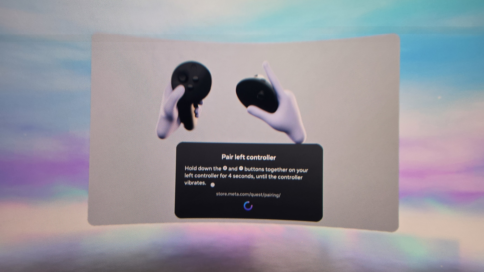
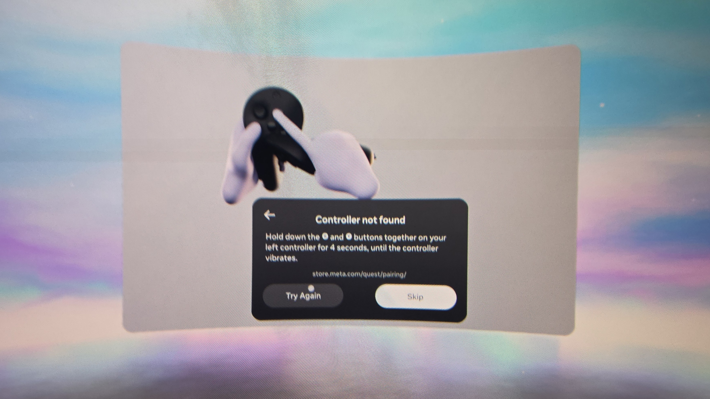
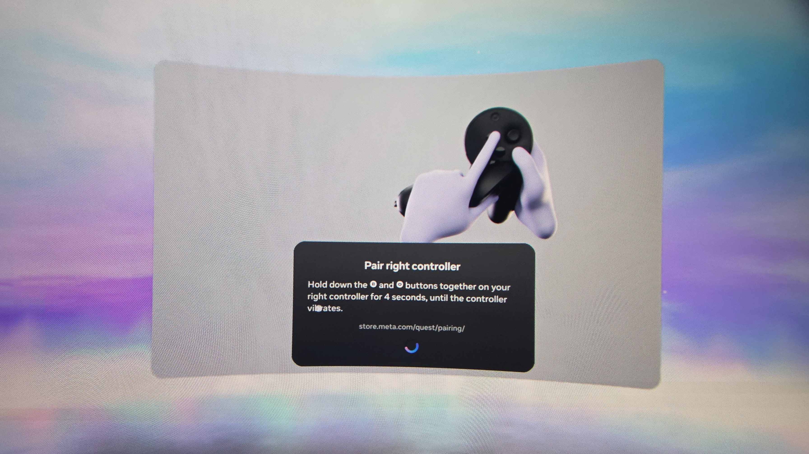
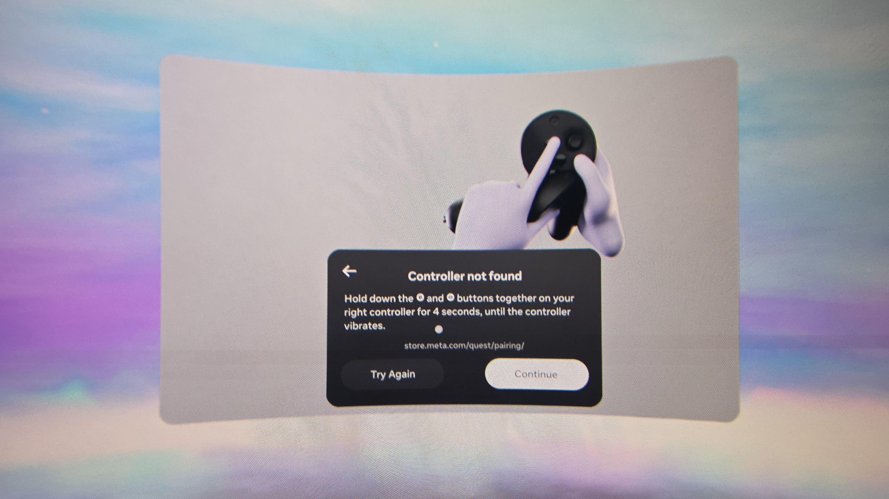
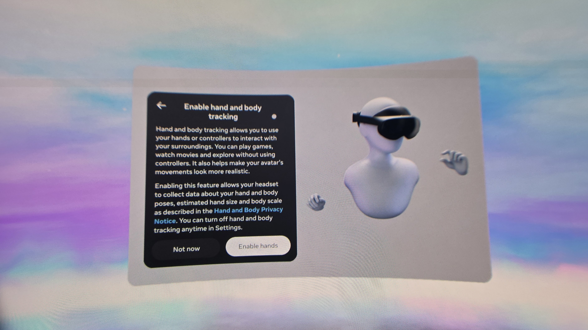

# Quest Pro Controllerless Setup Guide

A comprehensive, step-by-step guide on how to initialize and set up a Meta Quest Pro headset entirely without the use of Touch Pro controllers.

## 📋 Overview
This guide primarily targets users who owns, or have bought a second hand Meta Quest Pro without a functional or missing Touch Pro controllers who uses this headset primarily for PCVR and have no intention on using its "standalone" feature. This guide will walk you through step by step on setting up your Meta Quest Pro by utilising Hand Tracking during setup.

> **Disclaimer:** This method requires the use of the official Meta Software Update tool via a browser to force a firmware update on the headset. Follow the sequence exactly to avoid getting stuck in the pairing loop or potentially bricking your headset. I am not responsible for any bricked headsets. Do this at your own risk.

---

## 🛠 Prerequisites & Requirements
Before you begin, ensure you have the following ready:
* **Hardware:**
  * Meta Quest Pro Headset (Ensure that it is fully charged before proceeding)
  * USB-C data cable (You can use the cable that came with the headset or any reliable cable that you have)
  * Windows PC or Laptop (Haven't tested on Mac since I don't poses one)
  * A Mobile Device (Android or iOS)
* **Software/Accounts:**
  * Google Chrome or a Chromium-based browser installed on your PC (Google Chrome, Microsoft Edge, Brave Browser etc.)
  * Meta Horizon Mobile App installed and signed into your Meta account

---

## 🧭 Step-by-Step Setup Process
### Stage 1: Resetting the headset
We will need to prepare the headset in its "Factory" state. This step is just to ensure that no leftover setup was left behind and ensuring it to be in a clean state as possible. **Ensure your Quest Pro battery is fully charged or keep it plugged in to wall power to not interrupt the factory reset process.**

1. Turn the headset fully off by holding the Power Button (left side of the headset) until the "Headset Power" window appears.
2. Using the Volume Up button to confirm (right side of the headset), point the white dot on the screen to "Power Options" and "Power off".

*Alternatively, you can just hold the Power Button for 5-ish seconds or keep holding it down until you hear a shut down tone/chime*

3. Once the headset fully off, start holding down the Volume Down and Power Button until you see the "USB Update Mode" screen. 
4. Use Volume Down to highlight "Factory Reset" and confirm by using the Power Button.
5. An "Are you sure?" screen will appear. Use the Volume Down to highlight "Yes, erase and factory reset" and confirm by using the Power Button.

This will cause the headset to perform a Factory Reset and have it ready for us in a clean/blank state. Let it do its thing and at some point it will reboot and land you in the setup wizard. **Repeat steps 1 and 2 to power off the headset as we will need it off for Stage 2.**

---

### Stage 2: Updating the headset through Meta Software Update Tool
This "bypass" method requires the latest update of the Meta Horizon OS to be installed to the headset as this enabled the use of "Hand Tracking" during the setup process. This will require the use of a computer (A PC) using a Chromium-based browser to sideload the latest update. **Ensure that the device is already powered off before proceeding. You can repeat steps 1 and 2 in Stage 1 if you forgotten how to do so.**

1. On your PC, launch a **Chromium-based browser** (i.e. Google Chrome, Microsoft Edge, Brave Browser etc.)
2. Navigate to [Meta Software Update Tool](https://www.meta.com/help/quest/software_update/).
3. When the page loads, Select the "Meta Quest Pro" option and select "Get Started"
4. In the "Prepare Device" section, it will ask you to power off your device. Your headset should already be off so hit "Continue"
5. In the "Connect device" section, hold down the Volume Down and the Power Button to put it in "USB Update Mode".
6. Press the Volume Down button to highlight "Sideload update" and hit the Power Button to confirm.
7. Your headset will restart and at some point, the power LED on your headset will turn purple. Once you see this, plug your headset to your computer using a USB-C Cable.
8. Once plugged in to the computer, hit "Connect device" and a window will pop up with a title of "www.meta.com want to connect"
9. In this list, "Quest Pro" should be listed here. Select it to highlight it and hit "Connect"

> **Note**: The pop-up ***may*** appear again after hitting "Connect". Just hit "Cancel".

10. A "Ready for download" window will pop up. Select "Start download" to begin downloading the latest firmware.
11. Once downloaded, A "Ready to install" window ill pop up. Select "Install software to update the headset to the latest firmware.
12. Let it do its thing. **DO NOT UNPLUG DURING THIS PROCESS, YOUR HEADSET CAN BECOME A PAPERWEIGHT.**
13. At some point, the headset will finish sidloading the latest firmware and it will reboot.
14. Once rebooted to the setup screen, repeat Stage 1 to perform another Factory Reset to ensure a clean slate with the new firmware.

Resetting the headset again after sideloading the new firmware is necessary as we want to make sure that the newest firmware placed will now be the "Factory" image. You can try skipping the factory reset altogether after sideloading and skip to Stage 3 but I have not personally tested this.

---

### Stage 3: Setting up the headset without controllers
Hooray! Half-way there! Now, the whole reason why we are forcing the latest update is to let the "Pairing" step to fail when setting up the headset for the first time. Turns out that there is a timeout to pair the controllers to the headset and allows us to skip it. Thanks to [qi999ig](https://www.reddit.com/r/OculusQuest/comments/1p356lr/quest_12pro33s_no_controller_setup_full_guide/#:~:text=ago-,If,successfully%2E) for pointing this out in this thread.

1. Boot up the headset. (If it was off already)
2. To Navigate around the UI, a white dot will appear in the center of your view as a pointer. Move and/tilt your head to move said dot to the arrow or buttons and use the Volume Buttons (I preferred Volume Up) to confirm your selection.

2. Click **Next** a couple of times until you reach the "Turn on Controllers" screen.
3. Wait for the first menu asking to turn on the controllers. At some point, it will fail and return you with "Controllers not found". You can now select **Pair**.

4. Wait roughly 30 seconds for the *Left Controller Pairing* prompt to fail, then select **Skip**.

5. When the *Right Controller Pairing* prompt appears, wait for it and select **Continue**.

6. This will prompt the "Enable hand and body tracking" window to appear. From here, select "Enable hands"

7. Viola! if this was done correctly, you should start seeing your hands in your headset!

To navigate around the menu with your hands, reach your hand out and make a pinching gesture to perform a "click". From here on out, just keep hitting next and continue with the headset setup. At some point, it will you to connect to your Wi-Fi network, adjusting your fitment with the headset, Health and Safety, pairing the headset to a Meta Account through the Meta Horizon App on your phone, Privacy, and Facial Tracking settings.

---

## 🎉 Completion
After configuring your headset preferences, you will be greeted with the **"Device setup is complete"** screen. 

Select **Done**, and you will drop straight into your home environment (Loft) using full hand tracking navigation!

---

## 🤝 Contributing & Credits
* All testings were done on my Meta Quest Pro and confirm worked without using the controllers.
* Source inspiration and findings via [r/OculusQuest](https://www.reddit.com/r/OculusQuest/comments/1p356lr/quest_12pro33s_no_controller_setup_full_guide/).
* Special thanks to [qi999ig](https://www.reddit.com/r/OculusQuest/comments/1p356lr/quest_12pro33s_no_controller_setup_full_guide/#:~:text=ago-,If,successfully%2E) for pointing this out specifically for the Meta Quest Pro

Feel free to fork this repository, submit Pull Requests, or open an Issue if Meta changes the setup flow in future firmware updates!
